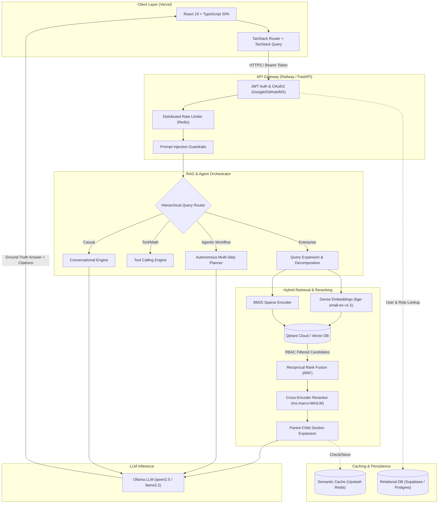

# 🔐 NeroxaAI — Secure Enterprise Knowledge Assistant with Role-Based Access Control (RBAC)


A production-grade, enterprise-hardened Retrieval-Augmented Generation (RAG) platform featuring **Zero-Trust Role-Based Access Control (RBAC)**, **Hybrid Vector Retrieval (Dense + Sparse BM25)**, **Cross-Encoder Reranking**, **Parent-Child Document Chunking**, **Semantic Redis Caching**, **Multi-Agent Orchestration**, and **Social/OAuth2 Authentication**.

---

## 🏛️ System Architecture



---

## ✨ Key Capabilities & Highlights

### 1. 🛡️ Enterprise Zero-Trust Role-Based Access Control (RBAC)
* **Metadata-Enforced Vector Search**: RBAC permissions (`admin`, `hr`, `finance`, `engineering`, `sales`, `employee`) are embedded directly into Qdrant vector payloads.
* **Filter Enforcing Boundaries**: A user in Marketing can never retrieve HR policies, financial records, or restricted engineering documents.
* **Audit & Compliance Logging**: Every search, document upload, login attempt, and permission change is recorded in PostgreSQL with timestamp, IP address, user identity, and event type.

### 2. 🔍 Advanced Hybrid Retrieval Pipeline
* **Dense Semantic Search**: 384-dimensional dense vectors using `BAAI/bge-small-en-v1.5`.
* **Sparse Lexical Search**: Term-hashed BM25 sparse vectors for exact keyword, part-number, and nomenclature matching.
* **Reciprocal Rank Fusion (RRF)**: Merges dense and sparse vector candidate pools using $RRF(d) = \sum \frac{1}{60 + r_m(d)}$.
* **Cross-Encoder Reranking**: Re-ranks top candidates using `cross-encoder/ms-marco-MiniLM-L-6-v2` to select the highest-precision evidence chunks.
* **Parent-Child Context Expansion**: Chunks small (~150 words) child blocks for vector precision while resolving and feeding full (~600 words) parent sections to the LLM.

### 3. 🧠 Multi-Agent & Hierarchical Query Routing
* **Hierarchical Router**: Automatically classifies user queries into Casual Conversation, Arithmetic/Tool Calling, Direct Enterprise RAG, or Multi-Step Agent workflows.
* **Query Decomposition**: Splits complex multi-condition queries into targeted sub-searches and aggregates evidence before synthesis.
* **Self-Contained Calculator & System Tools**: Evaluates arithmetic expressions safely without LLM hallucination.

### 4. ⚡ Semantic Caching with Redis
* Uses **Upstash Redis / Redis** to store vector embeddings of answered queries.
* Executes cosine similarity lookup on incoming queries (threshold $\ge 0.90$) scoped by `(user_id, role, department, pipeline_version)`.
* Returns sub-10ms cached answers with zero cross-tenant or cross-department leakage.

### 5. 🔐 Multi-Layer Anti-Jailbreak Guardrails
* NFKC Unicode normalization to defeat homoglyph and zero-width obfuscation.
* Regex and phrase signature matching blocking prompt injections, role-impersonation, and system prompt override attempts.

---

## 🛠️ Technology Stack

| Layer | Technologies Used |
|---|---|
| **Frontend UI** | React 19, TypeScript, Vite, TanStack Router, TanStack Query, Tailwind CSS, Lucide Icons |
| **Backend API** | FastAPI, Python 3.11/3.12, Pydantic v2, SQLAlchemy 2.0 ORM, Uvicorn |
| **Relational Database** | PostgreSQL 16 (Supabase / Neon / AWS RDS compatible) |
| **Vector Database** | Qdrant (Qdrant Cloud with API Key + TLS / Local Qdrant Container) |
| **In-Memory Cache** | Upstash Redis / Redis (Semantic Cache, Rate Limiting) |
| **Embedding Models** | `BAAI/bge-small-en-v1.5` (Dense) + BM25 Hash Encoder (Sparse) |
| **Reranker Model** | `cross-encoder/ms-marco-MiniLM-L-6-v2` |
| **LLM Inference** | Ollama (`qwen2.5:0.5b`, `qwen2.5:3b`, `llama3.2:1b`, `qwen2.5:7b`) |
| **Authentication** | JWT (HS256), Passlib (Bcrypt), OAuth2 (Google, GitHub, Microsoft), OTP Email Verification |
| **Deployment** | Vercel (Frontend), Railway (Backend & Ollama), Supabase (PostgreSQL), Qdrant Cloud (Vector DB) |

---

## 📁 Project Structure

```
enterprise-rag/
├── frontend/                     # React 19 + TypeScript + Vite SPA
│   ├── src/
│   │   ├── api/                  # API client services (workspace, assistant, types)
│   │   ├── auth/                 # JWT adapter, OAuth handlers, auth context
│   │   ├── routes/               # TanStack file-based routes (Dashboard, Chat, Docs, Admin, Users, Roles, Audit)
│   │   ├── shared/               # UI components, layout, navigation, modals, theme
│   │   └── documents/            # Document viewer, upload widgets, admin dialogs
│   ├── package.json
│   └── vite.config.ts
│
├── backend/                      # FastAPI Python Application
│   ├── api/                      # Router aggregation & security dependencies
│   ├── auth/                     # JWT token handling, OAuth2 providers, OTP verification
│   ├── users/                    # User accounts service & admin endpoints
│   ├── roles/                    # RBAC permission matrix & dependency guards
│   ├── documents/                # Ingestion saga, parser, parent-child chunker, sync
│   ├── embeddings/               # Dense (bge-small) & Sparse (BM25) encoders
│   ├── retriever/                # Qdrant client, hybrid search (RRF), cross-encoder reranker
│   ├── cache/                    # Semantic Redis cache with vector similarity lookup
│   ├── router/                   # 2-stage hierarchical query routing
│   ├── query/                    # Conversation query rewriter & history context
│   ├── rag/                      # Core RAG pipeline, context expansion & SSE streaming
│   ├── agent/                    # Multi-step autonomous agent planner & executor
│   ├── tools/                    # Tool calling registry & sandboxed executors
│   ├── web/                      # DuckDuckGo web search integration
│   ├── llm/                      # Ollama client, prompt engineering, anti-injection guardrails
│   ├── audit/                    # Compliance audit logging service
│   ├── database/                 # SQLAlchemy 2.0 session factory & seed initializer
│   ├── models/                   # ORM Models (User, Role, Document, ChatSession, AuditLog)
│   ├── config.py                 # Centralized Pydantic application settings
│   ├── main.py                   # FastAPI app entry point & lifespan handler
│   └── requirements.txt
│
├── docker/                       # Containerization & Compose orchestration
│   ├── Dockerfile
│   └── docker-compose.yml
└── README.md
```

---

## 🔑 Role-Based Access Control (RBAC) Matrix

| Role | Department Scope | Key Permissions |
|---|---|---|
| **Admin** | All Departments | Full System Access: User Management, Role Assignment, Audit Logs, Document Ingestion & Deletion, Global RAG Query |
| **HR** | HR + General | Upload & query HR policies, employee benefits, onboarding guidelines |
| **Finance** | Finance + General | Ingest & query financial statements, payroll procedures, petty cash policies |
| **Engineering** | Engineering + General | Read & search architectural RFCs, API documentation, technical runbooks |
| **Sales** | Sales + General | Query sales collateral, product brochures, customer battlecards |
| **Employee** | General | Query company-wide announcements, holidays, code of conduct |

---

## 🚀 Local Development Setup

### 1. Prerequisites
* Python 3.11 or 3.12
* Node.js 18+ & npm
* Docker Desktop (optional, for local PostgreSQL/Qdrant/Redis)
* Ollama installed locally (`ollama pull qwen2.5`)

### 2. Backend Setup
```bash
# Navigate to repository root
cd enterprise-rag

# Create virtual environment
python -m venv venv
# On Windows:
.\venv\Scripts\activate
# On Linux/macOS:
source venv/bin/activate

# Install dependencies
pip install -r backend/requirements.txt

# Create .env from template
cp .env.example .env

# Run FastAPI backend
uvicorn backend.main:app --host 0.0.0.0 --port 8000 --reload
```

### 3. Frontend Setup
```bash
cd frontend
npm install
npm run dev
```
Open `http://localhost:5173` in your browser.

---

## 🌐 Production Deployment Guide

### Architecture Topology

```
┌─────────────────┐       ┌─────────────────┐       ┌─────────────────┐
│     Vercel      │ ----> │     Railway     │ ----> │    Supabase     │
│  (React UI SPA) │       │ (FastAPI & LLM) │       │  (PostgreSQL)   │
└─────────────────┘       └─────────────────┘       └─────────────────┘
                                   │
                         ┌─────────┴─────────┐
                         ▼                   ▼
                  ┌─────────────┐     ┌─────────────┐
                  │Qdrant Cloud │     │Upstash Redis│
                  │ (Vector DB) │     │   (Cache)   │
                  └─────────────┘     └─────────────┘
```

### Environment Variables Checklist

#### Railway (Backend Service)
```env
DATABASE_URL=postgresql://postgres:[PASSWORD]@[HOST]:[PORT]/postgres
QDRANT_URL=https://[CLUSTER_ID].[REGION].aws.cloud.qdrant.io:6333
QDRANT_API_KEY=[YOUR_QDRANT_API_KEY]
QDRANT_COLLECTION=enterprise_docs
REDIS_URL=rediss://default:[PASSWORD]@[HOST].upstash.io:6379
OLLAMA_BASE_URL=https://[YOUR_OLLAMA_SERVICE].up.railway.app
OLLAMA_MODEL=qwen2.5:0.5b
JWT_SECRET_KEY=[STRONG_RANDOM_SECRET]
JWT_ALGORITHM=HS256
JWT_ACCESS_TOKEN_EXPIRE_MINUTES=480
BACKEND_URL=https://[YOUR_BACKEND].up.railway.app
FRONTEND_URL=https://[YOUR_FRONTEND].vercel.app
CORS_ORIGINS=https://[YOUR_FRONTEND].vercel.app,http://localhost:5173
```

#### Vercel (Frontend Project)
```env
VITE_API_URL=https://[YOUR_BACKEND].up.railway.app
```

---

## 📡 API Reference Overview

| Method | Endpoint | Description | Auth Required |
|---|---|---|---|
| `POST` | `/api/v1/auth/login` | Authenticate user & issue JWT | No |
| `POST` | `/api/v1/auth/register` | Self-service registration | No |
| `GET` | `/api/v1/auth/oauth/{provider}/login` | Initiate OAuth2 social login (Google/GitHub/MS) | No |
| `GET` | `/api/v1/auth/me` | Fetch authenticated user profile | Yes (Bearer) |
| `GET` | `/api/v1/documents/` | List accessible documents based on user role | Yes (Bearer) |
| `POST` | `/api/v1/documents/upload` | Ingest and index new enterprise document | Yes (Admin/Dept) |
| `DELETE`| `/api/v1/documents/{doc_id}` | Delete document & vector embeddings | Yes (Admin) |
| `POST` | `/api/v1/chat/message` | Multi-turn conversational RAG query | Yes (Bearer) |
| `GET` | `/api/v1/chat/sessions` | List user chat sessions | Yes (Bearer) |
| `POST` | `/api/v1/query` | Direct single-turn RAG query | Yes (Bearer) |
| `POST` | `/api/v1/rag/stream` | Real-time Server-Sent Events (SSE) token stream | Yes (Bearer) |
| `GET` | `/api/v1/users/` | List all system accounts | Yes (Admin) |
| `GET` | `/api/v1/roles/` | List all RBAC roles & permissions | Yes (Bearer) |
| `GET` | `/api/v1/admin/audit-logs/` | Query compliance audit trail | Yes (Admin) |

---

## 🛡️ Security & Privacy Principles

1. **No Data Leakage Between Roles**: Documents and vectors carry strict metadata tags (`department`, `access_scope`). Unprivileged queries cannot retrieve chunks belonging to restricted departments.
2. **Encrypted Passwords & Sessions**: Passwords hashed with `bcrypt`. JWT access tokens signed with HMAC-SHA256.
3. **Stateless API Gateway**: Fully containerized backend with decoupled persistent storage for horizontal scalability.
4. **Sanitized Document Ingestion**: Filenames sanitized against directory traversal attacks; document text cleaned before vectorization.

---

## 📄 License
This project is open-source software licensed under the [MIT License](LICENSE).
